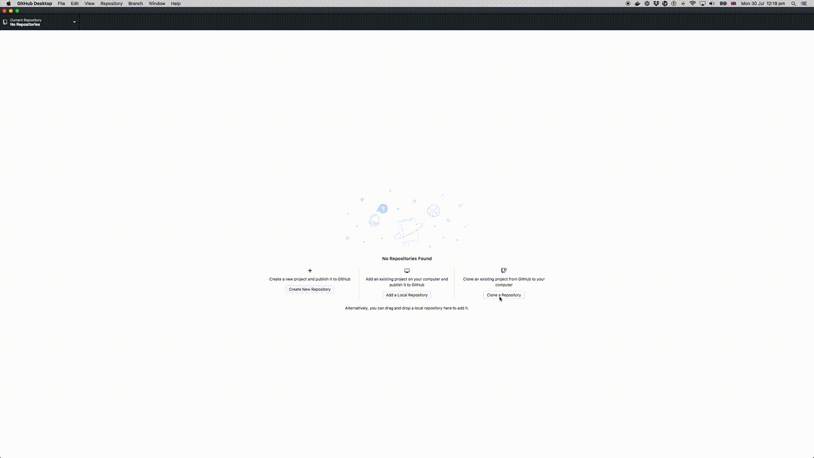

## Younglings

## What it is?

This is a [Badger Way - Dev Edition](https://docs.google.com/presentation/d/1RniEJbkB1BQCe4_NZMUnIx_1kgV4dfPN0wx6-aZ_Q0M/edit?usp=sharing) exercise for non technical people to create awareness about the Red Badger development process.

## Pre requisites

- [ ] An account on [GitHub](https://github.com/)
- [ ] [GitHub Desktop](https://desktop.github.com/) installed in your machine and linked to your GitHub account
  - _To link your GitHub Desktop with your account, please follow this [instructions](https://help.github.com/desktop/guides/getting-started-with-github-desktop/authenticating-to-github/)_
- [ ] [Visual Studio Code](https://code.visualstudio.com/download) installed in your machine

## Instructions

- Please _clone_ this repo to your _Desktop_ folder using the following URL `https://github.com/redbadger/younglings.git` 
- On GitHub Desktop create a new branch with your first and lastname 
- Please, navigate to [`src/template`](../src/template) folder and copy and paste changing its name to your first and lastname

  - `template` ---> `paul-roper`

- Add your details to the business card 

- Push your changes and you can see it on the following enviroments
  - Testing
    ```
    https://younglings-<BRANCH_NAME>.s3-eu-west-1.amazonaws.com/index.html
    ```
  - Staging
    ```
    https://younglings-staging.s3-eu-west-1.amazonaws.com/index.html
    ```
  - Production
    ```
    https://younglings-production.s3-eu-west-1.amazonaws.com/index.html
    ```
